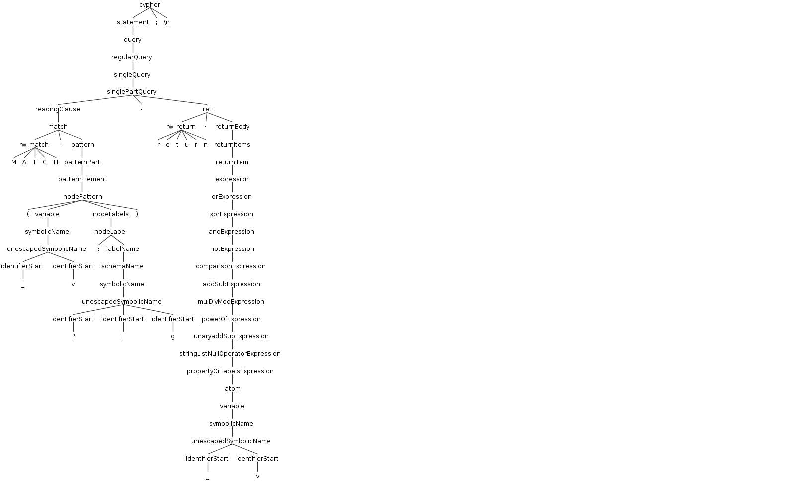
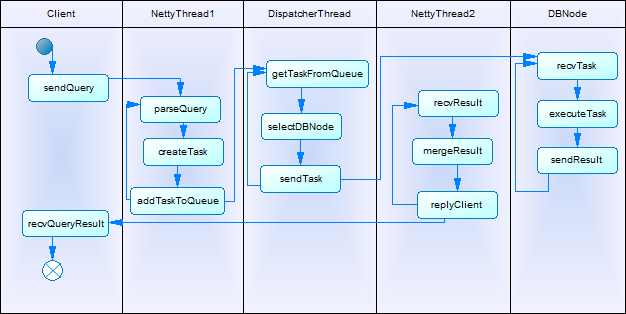
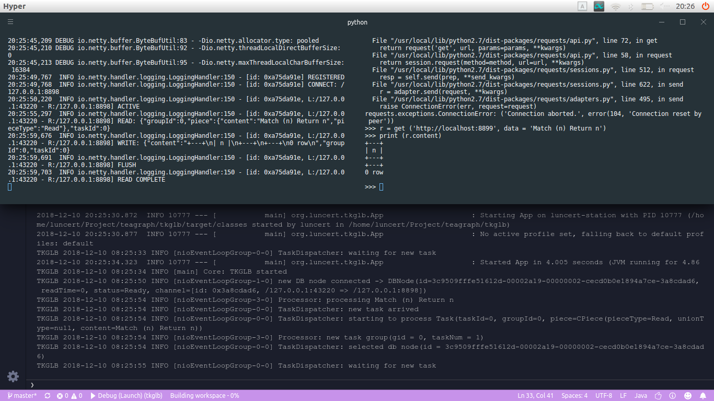

# teagraph

 

-------

## 这是

名称嘛……分布式图数据库中间件！其实就是在多台机子上部署一个 neo4j，然后通过中间件实现读写分离。第一阶段的目标是读写分离，第二阶段的目标是负载均衡，然后是还没有考虑。

## 模块

### cypher解析器

根据铁道图写 ANTLR 的语法定义，用 ANTLR 生成从源码解析 AST 的解析器。难度比直接上编译原理低得多，不过写语法定义也花了不少时间，结果像这样：


四百多行……能成功解析负载 cypher 语句的时候还是很 cool 的！eg：



cypher 解析器的功能是解析客户端 query，将其中读写部分拆分成多个任务，每个任务由一个数据库节点来执行。拆分任务时是不是还可以更加细粒度呢？譬如```Match (n:Pig) Return n```也让多个数据库节点执行，当然这个例子不合适。

### 调度模块——tkglb

功能：接收客户端 cypher 请求，调用 cypher 模块解析请求生成任务，分发任务到数据库节点（tkgdb 模块）。



###### 说明：

* Client：tkgdriver 模块，提供给用户连接 tkglb。
* NettyThread1、NettyThread2：实际是Netty 的工作线程组，而不是单个线程。
* DispatcherThread：调度线程，实际上是作为任务提交到 Netty 的主事件循环组中的，即也是运行在 Netty 创建的线程上。
* DBNode：数据库节点，预先通过 netty 连接上 tkglb。

###### 流程：

 * 客户端首先发送 query，这里使用 http 传输，所以不一定通过 tkgdriver 来发送。
 * tkglb 收到 query，使用 cypher 解析器解析生成任务组（即将一个请求中的读写部分拆分成多个任务），提交任务组到任务队列。
 * 正在等待任务队列的调度线程被唤醒，从队列中取出一个任务，选择一个 DBNode（这里是实现负载均衡的地方，现在选择最优节点的依据是读次数最少的节点，使用最小堆实现），将任务发送给被选中的 DBNode。
 * DBNode 接收到任务，开始执行，执行结束后发送执行结果给 tkglb。
 * tkglb 在 NettyThread2 中接收到执行结果，当所有任务均得到执行结果后合并执行结果，发送给 Client。

###### 任务的同步：

分布式数据库现在采取同构数据库的方案，每次从任务队列中获取到写任务时需要对所有节点进行一次写操作。任务同步即读写同步，只要保证一个节点上执行一次读操作前所有先到来的写任务已经执行完成即可。如果节点上还有等待执行的写任务，新的读任务将不会发送给该节点，即使它的读次数最少。

任务分发效率还可以提高。调度线程选择节点时，只会从没有执行任务的节点中选取读次数最少的节点，如果在节点上增加等待执行的任务队列，节点正在工作时也可以接收任务放入任务队列中，这样可以节省掉执行结束后才传输任务导致的额外时间开销。

### 执行模块——tkgdb

demo版功能很简单，使用 Netty 接收任务、发送执行结果，使用 neo4j 的 Java API 执行任务。

neo4j 是否可以并发执行任务呢？并发时能性能能提升多少呢？待研究。

能不能实现主从复制呢？在一个数据节点 update 结束后，该节点直接传输数据文件更新的部分给其他节点，完成全体 update 呢？印象中 neo4j 的 Java API 应该是不支持这种操作的，有挑战性。

## 实际跑起来！！！



右上角在 python 里使用 requests 发送 query，可以看到发送的是```Match (n) Return n```，由于数据库是空的，所以返回时也是空的。左上角是 tkgdb，下半部分是 tkglb。只是跑起来了/哭……通过读写分离提高 neo4j 性能的目的可能还没有达到。


じゃね！