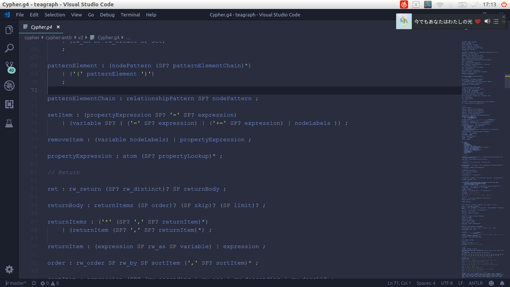

# teagraph

---

## 这是

名称嘛……分布式图数据库中间件！其实就是在很多台机上部署一个 neo4j，然后通过中间件实现读写分离。第一阶段的目标是读写分离，第二阶段的目标是负载均衡，然后是还没有考虑。

## 模块

### cypher解析器

根据铁道图写 ANTLR 的语法定义，用 ANTLR 生成从源码解析 AST 的解析器。难度比直接上编译原理低得多，不过写语法定义也花了不少时间，结果像这样：

四百多行……能成功解析负载 cypher 语句的时候还是很 cool 的！eg：

### tkglb

功能：接收客户端 cypher 请求，调用 cypher 模块解析请求生成任务，分发任务到数据库节点（tkgdb 模块）。