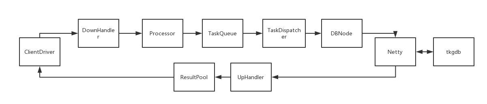
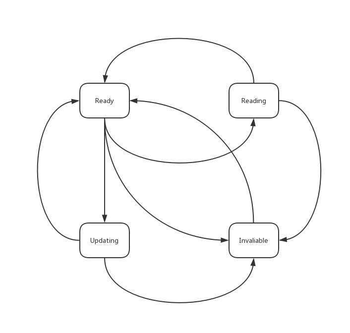

# TKGLB

#### 数据流图



#### 节点状态转换图



## 关于依赖

我用了两个我自己的工具包，没有上传github上。。。

```xml
<dependency>
    <groupId>org.luncert</groupId>
    <artifactId>mullog</artifactId>
    <version>1.0</version>
</dependency>
<dependency>
    <groupId>org.luncert</groupId>
    <artifactId>configer</artifactId>
    <version>1.0</version>
</dependency>
```

